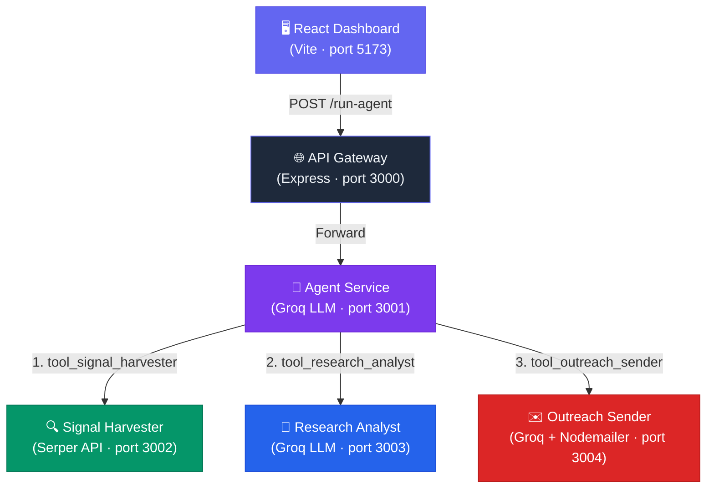

# 🔥 FireReach — Autonomous Outreach Engine

**Signal-driven, AI-powered outreach automation.** FireReach autonomously researches companies using live web signals and generates hyper-personalized cold emails — all orchestrated by an LLM agent with function calling.

## Architecture



## Agent Workflow

1. **Signal Harvester** → 5 targeted queries per company (funding, hiring, product launches, tech stack, expansion) with scoring, deduplication, and caching
2. **Research Analyst** → LLM generates a 2-paragraph account brief analyzing signals + ICP alignment
3. **Outreach Sender** → LLM generates a concise, signal-referencing cold email (≤120 words) and sends via SMTP

## Key Features

| Feature | Description |
|---|---|
| Multi-query harvesting | 5 signal queries per company for deep coverage |
| Signal scoring | Priority scoring (funding=10, hiring=8, etc.) with top-5 filtering |
| Tool execution guard | Strict Signal → Research → Email order enforcement |
| Retry + timeout | Exponential backoff on all external API calls |
| Request ID tracking | UUID-based request tracing across all services |
| Rate limiting | 10 req/min on the gateway |
| Signal caching | 30-minute cache to avoid redundant API calls |
| Agent reasoning trace | Full step-by-step execution log returned to frontend |
| Email quality guard | ≤120 words, 3 paragraphs max, must reference 2+ signals |
| Input validation | Email format, required fields, minimum lengths |

## Quick Start

### 1. Clone & Configure

```bash
cp .env.example .env
# Edit .env with your API keys:
#   GROQ_API_KEY   → https://console.groq.com
#   SERPER_API_KEY  → https://serper.dev
#   SMTP_*         → Your email SMTP credentials
```

### 2. Install Dependencies

```bash
cd api-gateway && npm install && cd ..
cd agent-service && npm install && cd ..
cd signal-harvester-service && npm install && cd ..
cd research-analyst-service && npm install && cd ..
cd outreach-sender-service && npm install && cd ..
cd frontend && npm install && cd ..
```

### 3. Start All Services

Open 6 terminals:

```bash
# Terminal 1 - API Gateway
cd api-gateway && npm start

# Terminal 2 - Agent Service
cd agent-service && npm start

# Terminal 3 - Signal Harvester
cd signal-harvester-service && npm start

# Terminal 4 - Research Analyst
cd research-analyst-service && npm start

# Terminal 5 - Outreach Sender
cd outreach-sender-service && npm start

# Terminal 6 - Frontend
cd frontend && npm run dev
```

### 4. Open Dashboard

Navigate to **http://localhost:5173** and fill in the ICP, company, and email fields, then click **Run FireReach Agent**.

## API Reference

### `POST /run-agent` (Gateway — port 3000)

```json
{
  "company": "Notion",
  "email": "outreach@notion.so",
  "icp": "B2B SaaS companies with 50-500 employees"
}
```

**Response** includes: `signals[]`, `brief`, `emailContent`, `emailSubject`, `sentStatus`, `trace[]`, `requestId`

### `POST /signals` (Signal Harvester — port 3002)

```json
{ "company": "Notion", "requestId": "req_abc123" }
```

### `POST /research` (Research Analyst — port 3003)

```json
{ "signals": [...], "icp": "...", "company": "Notion", "requestId": "req_abc123" }
```

### `POST /send` (Outreach Sender — port 3004)

```json
{ "company": "Notion", "email": "...", "brief": "...", "signals": [...], "requestId": "req_abc123" }
```

## Environment Variables

| Variable | Description |
|---|---|
| `GROQ_API_KEY` | Groq API key for LLM calls |
| `SERPER_API_KEY` | Serper API key for web search |
| `SMTP_HOST` | SMTP server host |
| `SMTP_PORT` | SMTP server port |
| `SMTP_USER` | SMTP username |
| `SMTP_PASS` | SMTP password |
| `EMAIL_FROM` | Sender email address |

## Tech Stack

- **Backend**: Node.js, Express
- **LLM**: Groq SDK (llama3-70b-8192)
- **Search**: Serper API
- **Email**: Nodemailer
- **Frontend**: React + Vite
- **Architecture**: Microservices (5 services + gateway)
